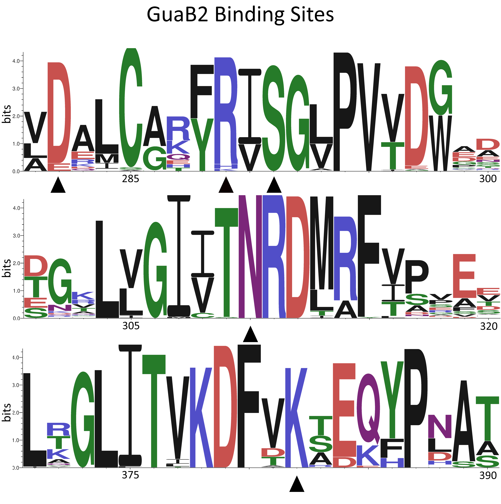
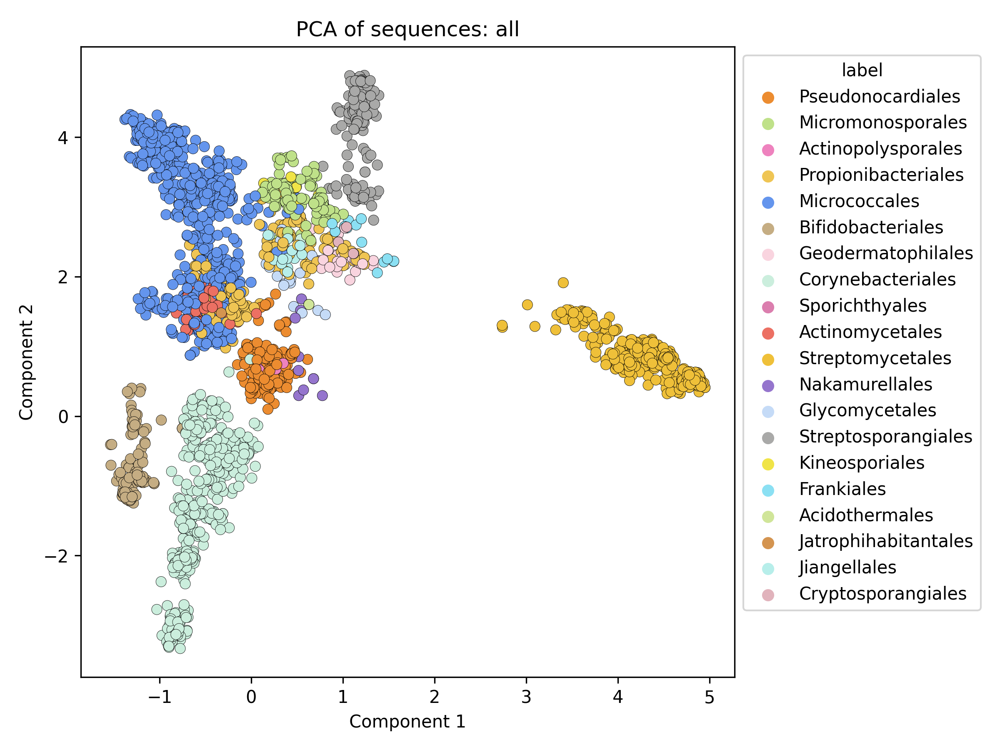
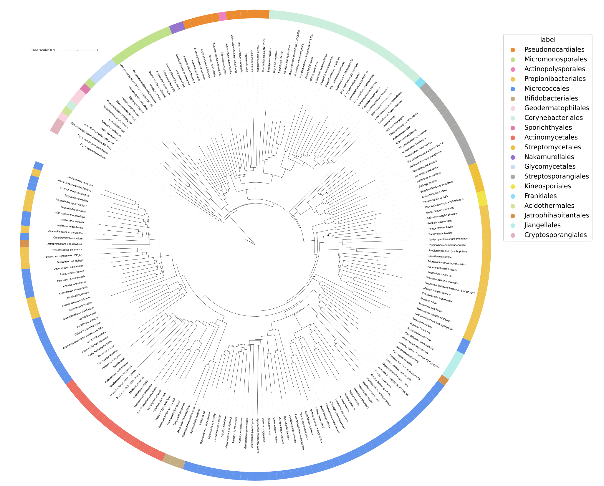

# GuaB2
This repository contains data for GuaB2 protein sequence analysis.

# Methods

The annotated genomic data, translated into protein sequences, were obtained using the ENTREZ API  [1] for all available representatives of the Actinomycetia class. "Unclassified" organisms were filtered out from the obtained genomes, and organisms denoted by the abbreviation “sp.” only one representative was retained for each such case. The final filter applied to the remaining genomes was the filtering  for a presence of similar sequences to GuaB2 from *M. smegmatis MC155* (https://www.ncbi.nlm.nih.gov/gene/?term=A0QSU3) using the BLAST algorithm [2] implemented in the bioinformatics library Biopython [3] The assumption is that representatives of actinomycetes contain three similar GuB2 sequences namely GuaB1, Guab2 and Guab3, therefore the genomes that were used for further processing had to contain at least three hits that probably signified the presence of the three sequences mentioned. Of the original 6480 genomes, 2846 genomes remained for final processing. For these, the GuaB2 sequence was identified using the PSI-BLAST [4] algorithm based on HMM profiling implemented in Biopython using the wrapper for NCBI BLAST+ tools [5].  Multiple GuaB2 sequence was performed by the MAFFT algorithm [6] (v. 7.407, gap extension penalty, gap opening penalty - default settings, Matrix = BLOSSUM), again command line wrapper for Biopython.

|**order**|**no species**| |**family**|**no species**| |**genus**|**no species**|
| :-: | :-: | :- | :-: | :-: | :- | :-: | :-: |
|Acidothermales|2| |Corynebacteriaceae|133| |Hoyosella|5|
|Actinomycetales|86| |Corynebacteriales incertae sedis|5| |Mycobacterium|123|
|Actinopolysporales|6| |Dietziaceae|8| |Mycobacteroides|8|
|Bifidobacteriales|134| |Gordoniaceae|39| |Mycolicibacillus|2|
|Catenulisporales|4| |Lawsonellaceae|1| |Mycolicibacter|9|
|Corynebacteriales|567| |Mycobacteriaceae|218| |Mycolicibacterium|71|
|Cryptosporangiales|4| |Nocardiaceae|153| | | |
|Frankiales|14| |Segniliparaceae|2| | | |
|Geodermatophilales|43| |Tsukamurellaceae|8| | | |
|Glycomycetales|16| | | | | | |
|Jatrophihabitantales|2| | | | | | |
|Jiangellales|14| | | | | | |
|Kineosporiales|9| | | | | | |
|Micrococcales|718| | | | | | |
|Micromonosporales|124| | | | | | |
|Nakamurellales|10| | | | | | |
|Propionibacteriales|218| | | | | | |
|Pseudonocardiales|204| | | | | | |
|Sporichthyales|5| | | | | | |
|Streptomycetales|495| | | | | | |
|Streptosporangiales|177| | | | | | |

This table shows the numbers of organisms, sorted by their respective orders, whose GuaB2 sequences were used for binding site analysis. Our goal was to fully cover all orders so that a full analysis of GuaB2 binding site conservation could be performed. This analysis is particularly aimed at investigating the M. 
smegmatis GuaB2 CBS domain binding site, so the table also presents the number of sequences we have accumulated for order Corynebacteriales and family Corynebacteriaceae M. Smegmatis belongs to.

  
   

The MAFFT GuaB2 sequence alignment could be used for several analysis.

1. Investigation of the degree of preservation of amino acid residues in the active site

*Figure 1 seqlogo showing the degree of conservation of the CBS domain binding site in the GuaB2 sequence, arrows indicate amino acid residues that directly participate in ligand binding.*

The python version of the R library seqLogo (v. 1.63.0) [7], [8] was used for the graphical representation of amino acid conservation. Consensus GuaB2 sequence computed by percentage identity can be found on this link: [Consensus GuaB2 sequence](data/all/Consensus_GuaB2_MAFFT_aligment.fasta)  The information content is measured in bits.Amino acid residues that can occur with equal probability at a given position have an information value of zero bits, while a position that is occupied by only one amino acid has an information value of four bits. In order to display the logo, we need to compute the Position Probability Matrix (PPM), which can be consulted in this notebook ([Create seqlogo colab notebook](https://colab.research.google.com/drive/1k_jFWg-pDz4aJW7baFWaSR2Ztzuj6lOH?usp=sharing)). The information content at position w in the displayed motif is given by the formula:

ICw=log2J+ j=1Jpwjlog2pwj= log2J-entropy(w)

1. Comparison of GuaB2 sequence similarity by PCA.

*Figure 2 The plot of the first two components of the output from the PCA algorithm shows the relatedness of the individual orders of the Actinomycetia class, the orders are distinguished by colour, see legend.* 

Principal component analysis (PCA) is an algorithm that can be used to reduce the dimension of a multivariate matrix. In this case, the matrix was prepared from the aligned GuaB2 sequences, the amino acid match or mismatch at each position was converted to a numerical matrix and the PCA matrix was calculated from it, which is a linear transformation of the original matrix. The first two components contain most of the variance of the original data and thus can be used to express the relationships between data points.

1. Establishing a phylogenetic tree based on a GuaB2 homology

*Figure 3 Pruned phylogenetic tree constructed from multiple alignments of GuaB2 sequences. Colors in the circle belong to individual orders.*

The phylogenetic tree was constructed using the following steps. GuaB2 sequences were aligned using the MAFFT algorithm, the resulting alignment was cleaned of regions with high variability using the BMGE algorithm [9]. The tree was constructed using the FastME algorithm [10] with 100-fold bootstrapping to statistically verify the resulting tree construction. Because the original tree contains a comparison of 2846 GuaB2 sequences, the tree was pruned using Treemmer[11], to remove branches contributing the least to the description of diversity between sequences. Final rendering of a phylogenetic tree was performed by online tool iTol [12].

## Bibliography

[1]	“Entrez Programming Utilities (E-Utilities),” in Encyclopedia of Genetics, Genomics, Proteomics and Informatics, Dordrecht: Springer Netherlands, 2008, pp. 612–612. doi: 10.1007/978-1-4020-6754-9_5383. 

[2]	S. F. Altschul, W. Gish, W. Miller, E. W. Myers, and D. J. Lipman, “Basic local alignment search tool,” J Mol Biol, vol. 215, no. 3, pp. 403–410, Oct. 1990, doi: 10.1016/S0022-2836(05)80360-2. 

[3]	B. Chapman and J. Chang, “Biopython,” ACM SIGBIO Newsletter, vol. 20, no. 2, pp. 15–19, Aug. 2000, doi: 10.1145/360262.360268. 

[4]	A. F. Neuwald, “PSI-BLAST searches using hidden Markov models of structural repeats: prediction of an unusual sliding DNA clamp and of beta-propellers in UV-damaged DNA-binding protein,” Nucleic Acids Res, vol. 28, no. 18, pp. 3570–3580, Sep. 2000, doi: 10.1093/nar/28.18.3570. 

[5]	C. Camacho et al., “BLAST+: architecture and applications,” BMC Bioinformatics, vol. 10, no. 1, p. 421, Dec. 2009, doi: 10.1186/1471-2105-10-421. 

[6]	K. Katoh and D. M. Standley, “MAFFT Multiple Sequence Alignment Software Version 7: Improvements in Performance and Usability,” Mol Biol Evol, vol. 30, no. 4, pp. 772–780, Apr. 2013, doi: 10.1093/molbev/mst010. 

[7]	T. D. Schneider and R. M. Stephens, “Sequence logos: a new way to display consensus sequences,” Nucleic Acids Res, vol. 18, no. 20, pp. 6097–6100, 1990, doi: 10.1093/nar/18.20.6097. 

[8]	Bembom O, “seqlogo: Sequence logos for DNA sequence alignments.” 2018. 

[9]	A. Criscuolo and S. Gribaldo, “BMGE (Block Mapping and Gathering with Entropy): a new software for selection of phylogenetic informative regions from multiple sequence alignments,” BMC Evol Biol, vol. 10, no. 1, p. 210, 2010, doi: 10.1186/1471-2148-10-210. 

[10]	R. Desper and O. Gascuel, “Fast and Accurate Phylogeny Reconstruction Algorithms Based on the Minimum-Evolution Principle,” Journal of Computational Biology, vol. 9, no. 5, pp. 687–705, Oct. 2002, doi: 10.1089/106652702761034136. 

[11]	F. Menardo et al., “Treemmer: a tool to reduce large phylogenetic datasets with minimal loss of diversity,” BMC Bioinformatics, vol. 19, no. 1, p. 164, Dec. 2018, doi: 10.1186/s12859-018-2164-8. 

[12]	I. Letunic and P. Bork, “Interactive Tree Of Life (iTOL) v5: an online tool for phylogenetic tree display and annotation,” Nucleic Acids Res, vol. 49, no. W1, pp. W293–W296, Jul. 2021, doi: 10.1093/nar/gkab301.
 

